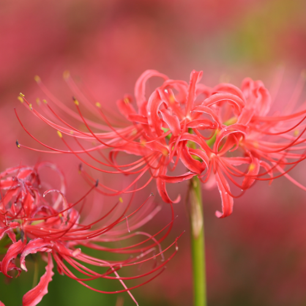

# 今日の演習（04-01)

## CSSの基本

### **【今日の課題】**

  1. 自己紹介サイトのコーディング
  2. 自己紹介サイト発表
  3. Webアワードの話
  4. chapter4の宿題

### **【CSSの基本】**

#### 画像の上に文字を表示

  1. 画像の上に文字を乗せる



```html
    <div class="flower">
        
        <p class="char">SAKURA</p>
    </div>
```

```css
    /* 基準にrelative */
    .flower{
        position:relative;
        width: 400px;
    }
    .char{
        font-size: 50px;
        color: #fff;
        position: absolute;
        top:100px;
        left:100px;
    }
```

### **【宿題】**

- [ ] htmlとcssの復習　教科書P147~226
